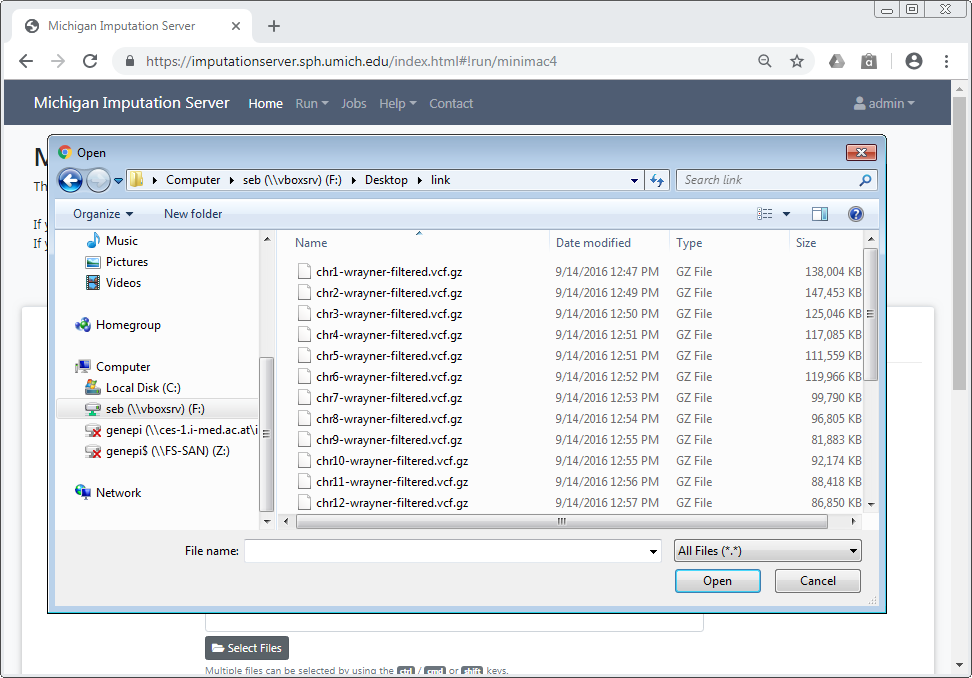
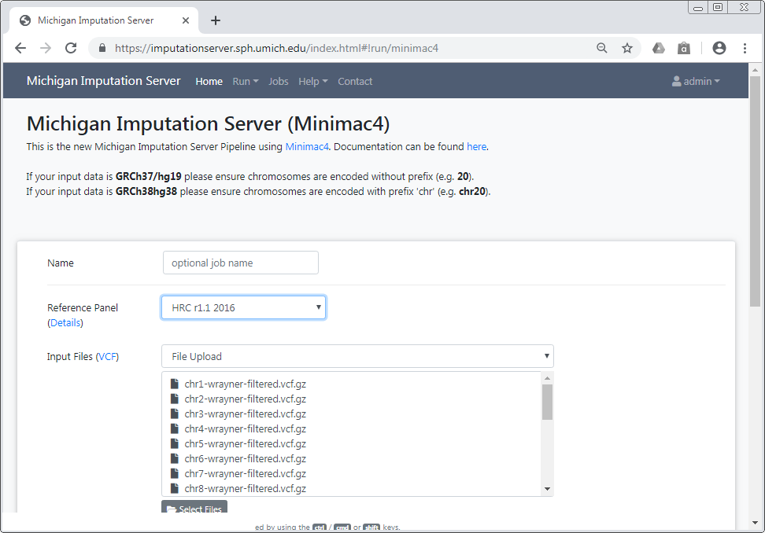
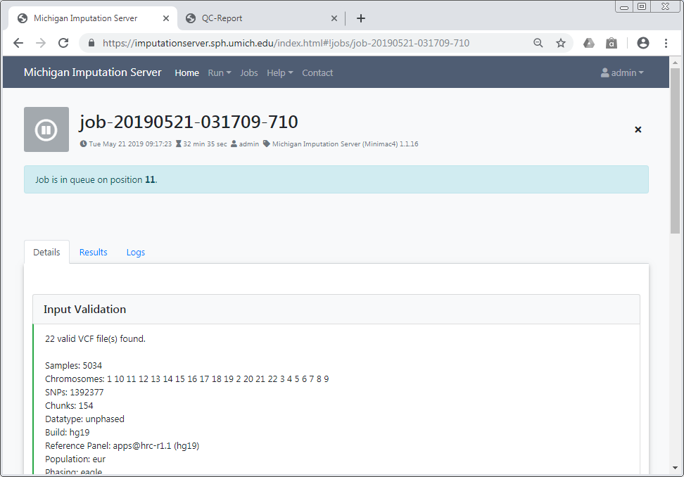
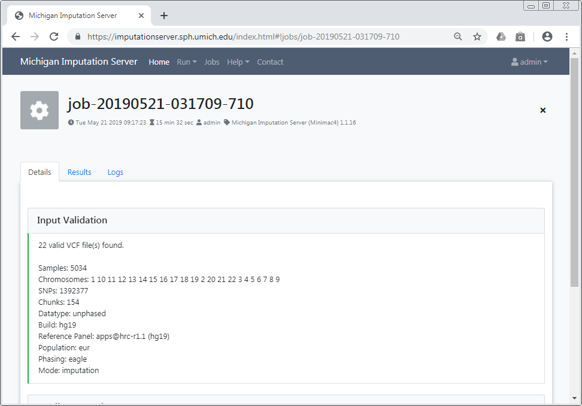

# Genotype Imputation

To use Michigan Imputation Server 2, [registration](https://imputationserver.sph.umich.edu/index.html#!pages/register) is required.
We will send an activation email to the provided address. Please follow the instructions in the email to activate your account. If the email does not arrive, ensure you have entered the correct address and check your spam folder. For PGS calculation, registration via email is optional.

**Once the account is active, the service can be used at no cost.**

Please cite this paper if you use Michigan Imputation Server 2:

> Das S, Forer L, Schönherr S, Sidore C, Locke AE, Kwong A, Vrieze S, Chew EY, Levy S, McGue M, Schlessinger D, Stambolian D, Loh PR, Iacono WG, Swaroop A, Scott LJ, Cucca F, Kronenberg F, Boehnke M, Abecasis GR, Fuchsberger C. [Next-generation genotype imputation service and methods](https://www.ncbi.nlm.nih.gov/pubmed/27571263). Nature Genetics 48, 1284–1287 (2016).

## Setup your first imputation job

Please [log in](https://imputationserver.sph.umich.edu/index.html#!pages/login) with your credentials and click on the **Run** tab to start a new imputation job.  The submission dialog will allow you to specify the properties of your imputation job.

The following options are available:

### Reference Panels

Our server offers genotype imputation using various reference panels. The most accurate and largest panel is **HRC (Version r1.1 2016)**. Please select a panel that best meets your needs and supports the population of your input data.

- HRC (Version r1.1 2016)
- 1000 Genomes Phase 3 (Version 5)
- 1000 Genomes Phase 1 (Version 3)
- CAAPA - African American Panel
- Genome Asia Pilot
- Samoan
- HapMap 2

We also provide **three different panels for HLA imputation**.

More details about all available reference panels can be found [here](./reference-panels.md).

### Upload VCF files from your computer

When using the file upload button, data is transferred from your local file system to Michigan Imputation Server 2. By clicking on **Select Files**, an open dialog will appear where you can choose your VCF files.

You can select multiple files by holding down the Ctrl, Cmd, or Shift key, depending on your operating system. After confirming your selection, all chosen files will be listed in the submission dialog.

Please ensure that all files meet the [requirements](/prepare-your-data).

!!! important
    Since version 1.7.2 URL-based uploads (sftp and http) are no longer supported. Please use direct file uploads instead. 

### Build
Please select the build of your data. Currently, the supported options are **hg19** and **hg38**. Michigan Imputation Server 2 will automatically update the genome positions (liftOver) for your data. 

### rsq Filter
To minimize the file size, Michigan Imputation Server 2 includes an r2 filter option that excludes all imputed SNPs with an r2-value (imputation quality) smaller than the specified threshold.

### Phasing

If your uploaded data is unphased, Eagle v2.4 or Beagle b5.4 will be used for phasing. If your VCF file already contains phased genotypes, please select the “No phasing” option.

!!! important
    Michigan Imputation Server 2 will rephase your data if a phasing engine is selected.

|  Algorithm | Description |
| ---------- |-------------|
| **Eagle v2.4** | The [Eagle](https://data.broadinstitute.org/alkesgroup/Eagle/) algorithm estimates haplotype phase using a specific reference panel. For HRC or 1000 Genomes imputation, the HRC panel is used for phasing. |

### Allele Frequency Check

Please select the population of your uploaded samples. This information is used solely to compare allele frequencies between your data and the reference panel. Note that not every reference panel supports all sub-populations. If “OFF” is selected, no frequency check will be performed.

!!! note
    In previous versions, this paramter was called "population".

|  Population | Supported Reference Panels |
| ----------- | ---------------------------|
| **AFR** | all |
| **AMR** | all |
| **EUR** | all |
| **Mixed** | all |
| **AA** | CAAPA |
| **ASN** | 1000 Genomes Phase 1 (Version 3) |
| **EAS** | 1000 Genomes Phase 3 (Version 5) |
| **SAS** | 1000 Genomes Phase 3 (Version 5) |

In case your population is not listed or your samples are from different populations, please select **Off** to skip the allele frequency check. 

### Mode

Please select if you want to run **Quality Control & Imputation** or **Quality Control Only**.

!!! important
    Results (e.g. QC Report) will be available only after the entire job is complete.

### AES 256 encryption

All Michigan Imputation Server 2 results are encrypted by default. If you prefer to use AES 256 encryption instead of the default method, please check this box. Note that AES encryption may not be compatible with standard unzip programs; we recommend using 7-Zip instead.

## Start your imputation job

After confirming our *Terms of Service**, you can start the imputation process immediately by clicking **Start Imputation**.  If your data passes the QC steps, your job will be added to our imputation queue and processed as soon as possible. You can check your position in the queue on the job summary page.

We will notify you by email as soon as the job is finished or if your data does not pass the quality control steps.

### Input Validation

In the first step, we check if your uploaded files are valid and calculate basic statistics, such as the number of samples, chromosomes, and SNPs.

After the input validation is complete, basic statistics can be viewed directly in the web interface.

If you encounter problems with your data, please read this tutorial on [Data Preparation](/prepare-your-data) to ensure your data is in the correct format.

### Quality Control

In this step, we check each variant and exclude it if it meets any of the following criteria:

1. contains invalid alleles
2. duplicates
3. indels
4. monomorphic sites
5. allele mismatch between reference panel and uploaded data
6. SNP call rate < 90%
7. Strand flips and allele swaps

All filtered variants are listed in a file called `statistics.txt`, which can be downloaded by clicking the provided link. More information about our QC pipeline can be found [here](/pipeline).

!!! important
    Due to changes in Minimac 4, Michigan Imputation Server 2 now includes filtering and checks for allele swaps. For more information, please read HERE.

If you selected a population, we compare the allele frequencies of the uploaded data with those from the reference panel. The results of this check are available in the QC report and can be downloaded by clicking on `qcreport.html`.

### Pre-phasing and Imputation

Imputation is achieved with Minimac4.

### Data Compression and Encryption
If imputation is successful, we will compress and encrypt your data and send you a random password via email.

!!! important  "Password not stored at any time"
     This password is not stored on our server at any time. Therefore, if you lost the password, there is no way to resend it to you.

## Download results

You will be notified by email as soon as the imputation job is complete. A zip archive containing the results can be downloaded directly from the server. To decrypt the results, a one-time password will be generated by the server and included in the email. The QC report and filter statistics are also available for viewing and download.

!!! important "All data is deleted automatically after 7 days"
      Be sure to download all required data within this time period. We will send you a reminder 48 hours before your data is deleted. Once your job reaches the retired state, we will not be able to recover your data!

###  Download via a web browser

All results can be downloaded directly through your browser by clicking on the filename.

To download results via the command line using 'wget' or 'aria2', click on the **share** symbol (located next to the file size) to obtain the necessary private links.

A new dialog appears which provides you the private link. Click on the tab **wget command** to get a copy & paste ready command that can be used on Linux or MacOS to download the file in you terminal:

### Download all results at once

To download all files in a folder (e.g., the folder **Imputation Results**), click on the **share** symbol for that folder.

A new dialog will appear, providing all your private links at once. Click on the **wget commands** tab to access copy-and-paste-ready commands that can be used on Linux or macOS to download all files.
