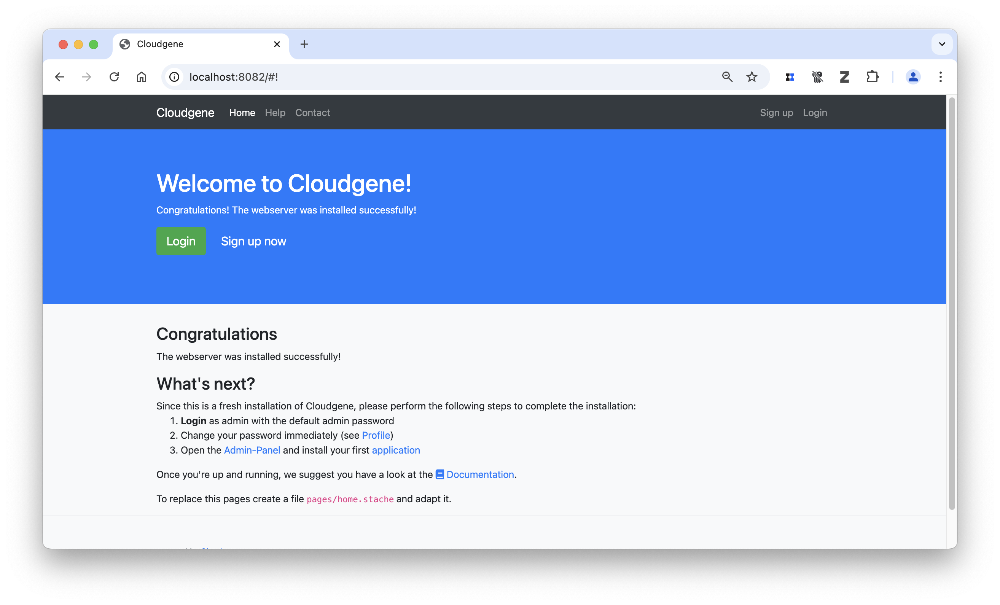
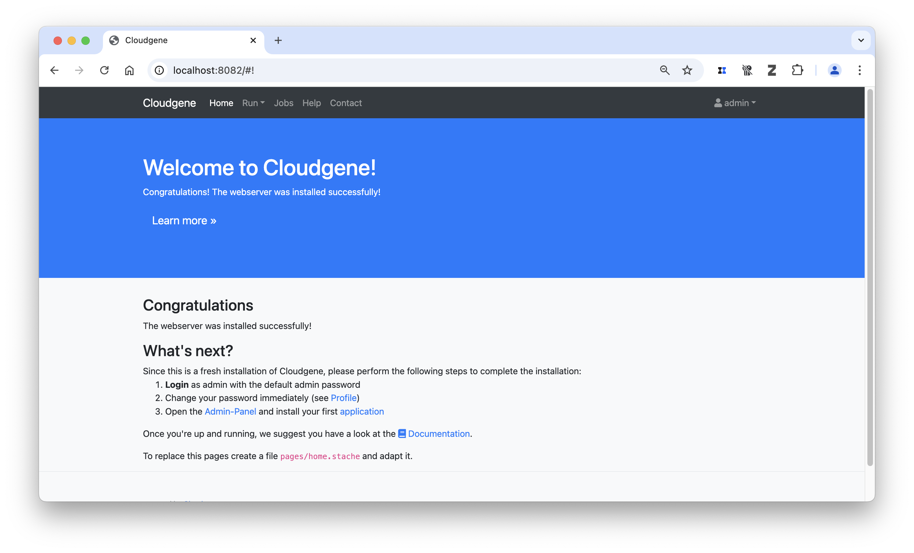
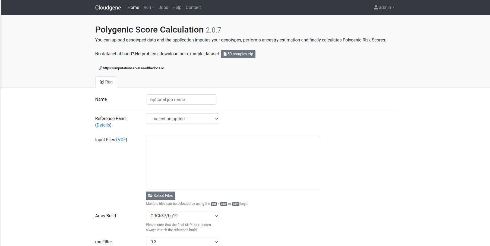
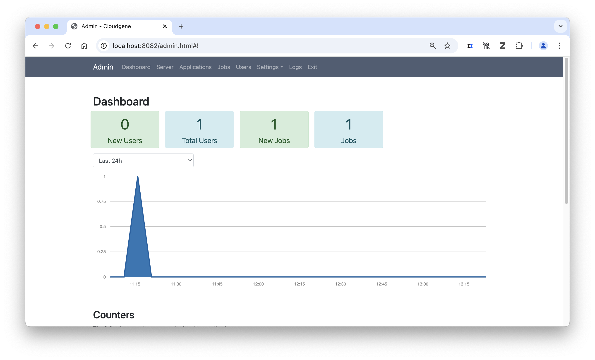
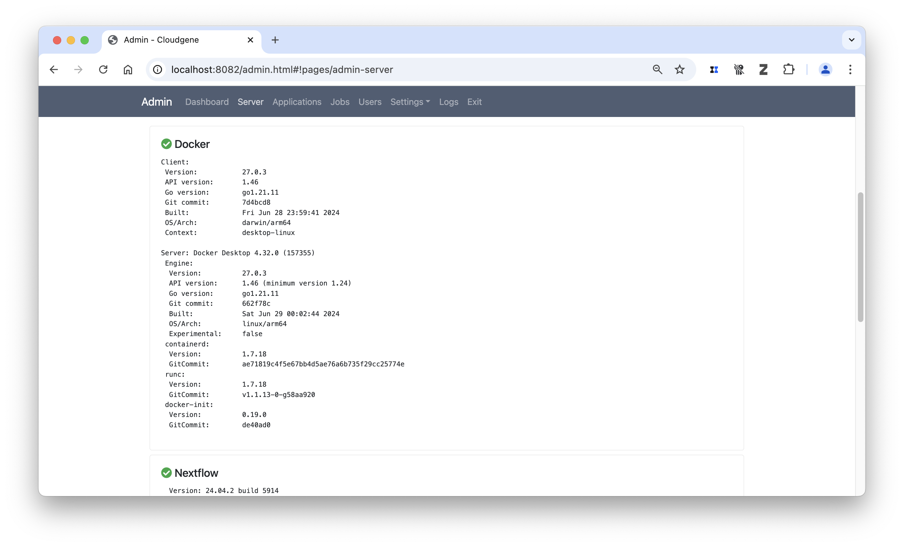
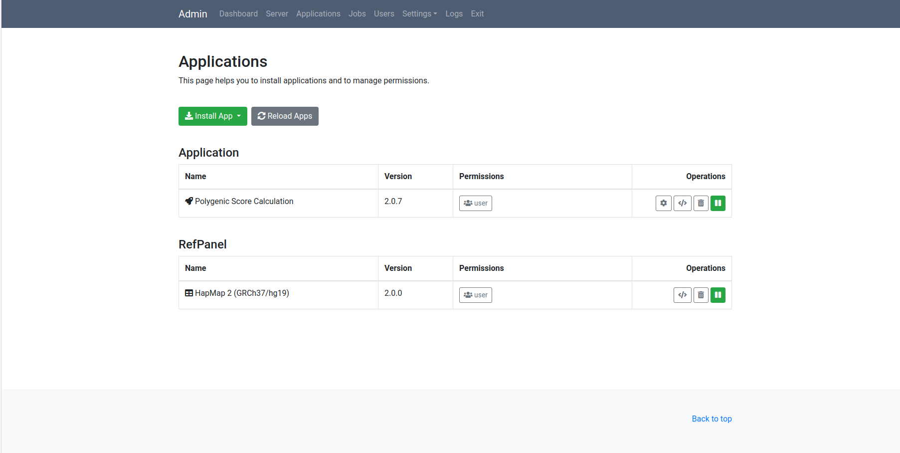
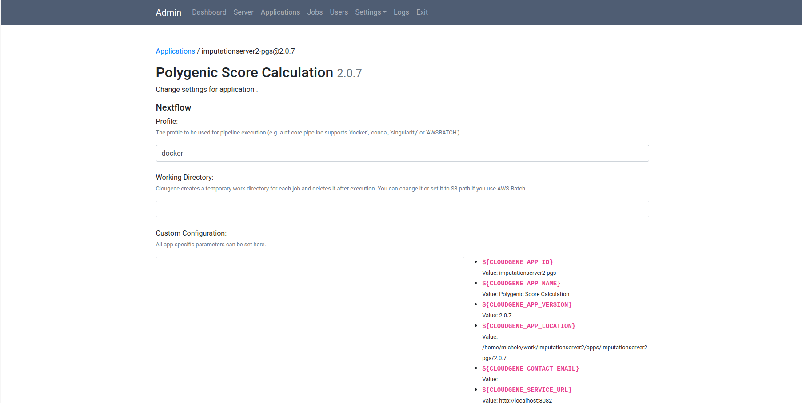
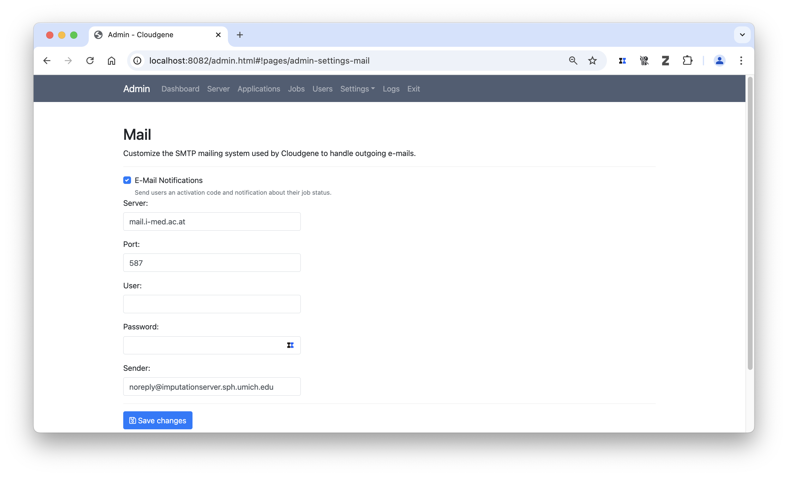
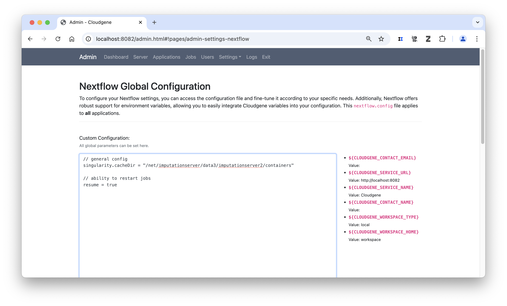

# Setting up a local PGS server

## Introduction
The Polygenic Score Calulation server allows the computation of polygenic risks based on imputed genotype and summary statistic, either provided locally or available through the [PGS-catalog](https://www.pgscatalog.org). For further details on the pipeline see [pgs-calc pipeline](../pgs/getting-started.md)

**One of our primary goals is to enable others to set up their own PGS calculation server using our architecture.** Such servers can then be utilized internally (e.g., within an institution to keep array or sequence data locally) or made accessible to external users, by providing sensitive reference panels to the community. 

In this tutorial we show how to setup the latest PGS service locally by using already available reference panels.

## Prerequistes
The following software is required to set up your own server. We specifically tested it on different Linux versions and on macOS.

* Java 17 or higher
* Nextflow
* Docker or Singularity
* MySQL Server (Optional)

## Step by Step Guide

### Step 1 - Create a local directory
The main installation directory contains all the necessary data to run a local instance of the imputation server. By default, it also stores all job results, the installed applications, and the database. All paths can be customized in the ```settings.yaml``` file at a later point. For now, please note that this directory can grow quite large.

```bash
mkdir pgscalcserver
```
!!! note
    In a Slurm setup, make sure this directory is located on a shared drive that is accessible by all nodes.


### Step 2 - Install Cloudgene

Cloudgene 3 offers a platform that converts Nextflow pipelines into scalable web services with just a few steps. More details are available in [our preprint](https://doi.org/10.1101/2024.10.27.620456) and recent [blog post](https://blog.stephenturner.us/i/150610509/cloudgene-transforming-nextflow-pipelines-into-powerful-web-services).

To install Cloudgene 3, run the following command:

```bash
cd pgscalcserver
curl -fsSL https://get.cloudgene.io | bash
./cloudgene version
```

If the last command successfully returns the currently installed version, everything is set up correctly.

### Step 3 - Install the PGS calc server pipeline,  PGS catalog and reference panel

In Cloudgene 3, everything is considered an app. This means that both the PGS calculation server pipeline, the PGS catalog and the reference panels can be installed through Cloudgene. Apps can be installed either via the graphical interface or the command line. In this case, we will install the latest version of our [PGS-calc](https://github.com/genepi/imputationserver2) directly from GitHub and the Hapmap2 panel and PGS catalog from an HTTP address.

```bash
# PGS pipeline
 ./cloudgene install genepi/imputationserver2/cloudgene.pgs.yaml
# reference frame
 ./cloudgene install https://imputationserver.sph.umich.edu/resources/ref-panels/imputationserver2-hapmap2.zip
# PGS catalog
./cloudgene install https://imputationserver.sph.umich.edu/resources/pgs-catalog/pgs-catalog-small.zip
```

>[!NOTE]
>If you want to install the large 1000 Genomes Phase 3 reference panel (hg19) instead, use [this address](https://imputationserver.sph.umich.edu/resources/ref-panels/imputationserver2-1000genomes-phase3-public.zip). 
>Similarly, you can choose [different PGS catalogs](https://imputationserver.sph.umich.edu/resources/pgs-catalog/) too.

>[!TIP]
>You can also download the pipeline or panel first and then specify a local path in the command above.
>For example, if you encounter issues installing the PGS workflow, you can downloading the yaml file and install it locally.
>```bash
>curl https://raw.githubusercontent.com/genepi/imputationserver2/refs/heads/main/cloudgene.pgs.yaml --output cloudgene.pgs.yaml
>./cloudgene install ./cloudgene.pgs.yaml
>```

Since we have now installed all the required apps, we will refer to the installation as the imputation server, even though technically it is a Cloudgene instance.

### Step 4 - Start your local imputation server
The local web service can now be started. By default, it runs on port 8082.

```bash
 ./cloudgene server
```
You can now open a local web browser and navigate to http://localhost:8082. This will display the default landing page, which can be customized later.

!!! note
     For server usage, run ```./cloudgene server &``` to run it in the background when everything has been set up. 



### Step 5 - Login and Run your first workflow
You can now log in using the default credentials (username: ```admin```, password: ```admin1978```). The interface will change slightly, with the **Run** tab becoming available.



By clicking on the **Run** tab, you should see the imputation server workflow, just as you would in the Michigan Imputation Server. 



This provides a basic setup for your local server and should already allow you to run a job on your local instance!

>[!IMPORTANT]
>Make sure  `docker`, or `singularity`, is running!

## Tweak your instance (Basics)

Our architecture provides numerous customizable settings, accessible only to admin users. To modify them, click on the admin user and open the **Admin Panel**. The panel provides details about all users, jobs, and applications, and allows you to customize your instance through various settings.



### 1) Check server status
First, let's check the overall server status, which includes the currently applied setup.

Most importantly, check if Docker and Nextflow have been detected. For a local setup, you should see green checks for both.




!!! note
    The status of Singularity is currently not monitored by the instance.

### 2) Set Nextflow profile
Next, we need to specify the default Nextflow profile for the pipeline. For the pgs-calc server, Docker is already set as the default profile. However, for this tutorial, we will configure it explicitly. Click on Apps in the Admin Panel, then click on the gear icon.



Now, set the profile value to 'docker' and click **Save Changes**.



!!! note
    Please note that we also provide other [profiles](https://github.com/genepi/imputationserver2/blob/main/nextflow.config), such as Slurm or Singularity profiles. 

### 3) Setting up a mail server
A mail server is required for user registration. You can configure it in the Admin Panel by navigating to **Settings** -> **Mail**. We recommend using a mail relay. If you set a password, please note that it will be stored in plain text in the ```settings.yaml``` file.


### 4) Setting up Nextflow mail support
The Nextflow pipeline is one of the two key components of the pgs-calc server. To adjust its settings, go to **Admin Panel** -> **Settings** -> **Nextflow**. Any configurations specified here will be applied to all apps. Alternatively, you can define app-specific Nextflow configurations by selecting **Apps** and clicking on the gear icon for a specific app.

The first setting you can customize is the mail configuration for sending notifications from the pipeline. Copy the following snippet to use the mail server configuration and apply it to your Nextflow pipeline.

```nextflow
params.send_mail=true
mail {
    from = "${CLOUDGENE_SMTP_NAME}"
    smtp.host = "${CLOUDGENE_SMTP_HOST}"
    smtp.port = "${CLOUDGENE_SMTP_PORT}"
}
```

### Set parameters
The pgs-calc Server pipeline offers a comprehensive set of [parameters](https://github.com/genepi/imputationserver2?tab=readme-ov-file#parameters). To customize these parameters, add them to the Nextflow section. The following snippet demonstrates how to modify specific parameters:
````
params.max_samples = 40000
params.min_samples = 1
````

## Tweak your instance (Advanced)
The Michigan Imputation Server operates on a Slurm cluster, which requires additional configuration. This section includes the required adjustments for HPC usage.


!!! note
    Our pipeline provides a Slurm profile, which should be specified instead of Docker or Singularity. If you require a different executor, feel free to submit a pull request. 

 
### Resume jobs

In case your server stops unexpectedly, jobs can be restarted via the web server by admin users (**Admin Panel** -> **Jobs**). To also utilize Nextflow's capability to restart jobs, this feature needs to be enabled. 
```
// ability to restart jobs
resume = true
```



### Set singularity location

As mentioned earlier, singularity or slurm can be set for each app in the profile field. Additionally, we recommend specifying the location of the singularity image to prevent multiple downloads.

```
singularity.cacheDir = "/net/imputationserver/data3/imputationserver2/containers"
```

### Slurm specific setup

Running it as a service for the community requires a well-configured Slurm cluster. If you plan to provide this as a service, we recommend setting up queues to optimize job wall time and using a scratch directory for large jobs. Specifying a scratch directory allows Nextflow to run large jobs on, for example, a faster SSD drive instead of using the distributed file system. The queues must be available on your Slurm cluster. Additionally, you can adjust the number of CPUs and the amount of RAM assigned to each task. Add the following to your Nextflow settings.

```bash
process {
    // use local HDD on each node
    scratch = '/data/nextflow-scratch'
    
    // default queue
    queue = 'mis-imputation'

    withLabel: preprocessing {
        queue = 'mis-preprocessing'
    }
    withLabel: postprocessing {
        queue = 'mis-postprocessing'
    }
    withLabel: phasing {
        queue = 'mis-phasing'
    }

    withName: 'EAGLE' {
    cpus = { 2 }
    memory = { 24.GB * task.attempt }
    }
  
    withName: 'BEAGLE' {
    cpus = { 2 }
    memory = { 24.GB * task.attempt }
    }

    withName: 'MINIMAC4' {
    cpus = { 2 }
    memory = { 24.GB * task.attempt }
    }
    
    withName: 'COMPRESSION_ENCRYPTION_VCF' {
    cpus = { 4 }
    memory = { 24.GB * task.attempt }
    } 

}
```
### Web Service Settings
As mentioned earlier, the settings.yaml file includes all settings from the web service itself. We recommend the following adjustments if you plan to scale it up for larger usage:

1) Set up a MySQL database to store all user and job information (by default, an H2 database is used).
```
database:
   database: 
   password: 
   driver: mysql
   port: 3306
   host: 
   user: 
```
2) Configure the workspace for output files.

The output folder for job results can be specified. We recommend placing it on a large HDD for better storage capacity.
```
externalWorkspace:
   location: /path/to/drive
   type: local
```

3) Modiy the default web service configuration

We recommend setting the following configuration options. For more details on available options, please refer to the documentation [here](https://www.cloudgene.io/server/configuration/).

```
threadsQueue: 30
uploadLimit: 15000
maxDownloads: 50
autoRetire: true
autoRetireInterval: 4
maxRunningJobsPerUser: 3
```

4) Adapt the landing page.

To achieve the same look and feel as the Michigan Imputation Server, copy the pages folder to the main directory of your installation.

### Summary

Cloudgene 3, in combination with our new Nextflow pipeline, transforms how imputation can be performed in the future. Please contact Lukas Forer and Sebastian Schönherr to learn more about how this can support your use cases!
